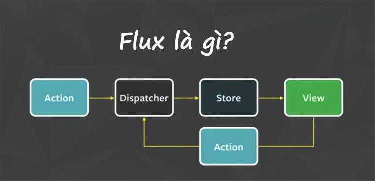
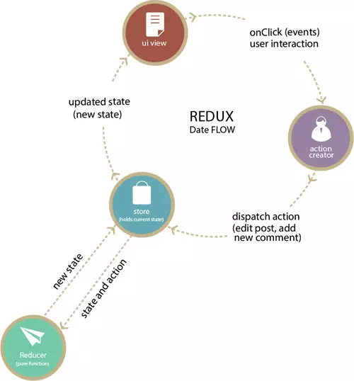

<h1>React Quick Start</h1>

# **REDUX**

## 1. Redux là gì
### **1.1 Flux** :
- Flux là một kiến thức quen thuộc được thêm bởi Facebook để sử dụng và làm việc với React. Flux không được xem là một Framework hay thư viện mà nó chỉ đơn giản là một kiểu kiến trúc hỗ trợ thêm cho React. Đồng thời, nó xây dựng các ý tưởng về luồng dữ liệu một chiều (tên tiếng anh là Unidirectional Data Flow). 
 

- Một kiến trúc Flux điển hình nhất là sự kết hợp giữa thư viện Dispatcher (được viết từ Facebook) cùng với Module Nodejs EventEmitter để có thể tạo nên một hệ thống sự kiện giúp quản lý các trạng thái hoạt động của ứng dụng. 
- **Cấu trúc của Flux**: 
  - <u>Actions</u> : Có nhiệm vụ làm dẫn truyền dữ liệu đến với Dispatcher (nó được xem tương tự như Helper Method). 
  - <u>Dispatcher</u> : Nhận những thông tin truyền đạt từ Actions để truyền tải dữ liệu tới các nơi đã thực hiện đăng ký nhận các thông tin. 
  - <u>Store</u> : Là nơi có nhiệm vụ lưu trữ cho trạng thái và các logic của hệ thống, đây là một trong những nơi có nhiệm vụ nhận đăng ký dữ liệu với Dispatcher.
  - <u>Controller View</u> : Được cho là các React Components có nhiệm vụ nhận các trạng thái từ Stores và truyền dữ liệu cho các thành phần con.    

### **2. Redux**
- **Redux** được xây dựng dựa trên nền tảng tư tưởng của ngôn ngữ Elm và kiến trúc Flux do Facebook giới thiệu. Do vậy Redux thường là bộ đôi kết hợp hoàn hảo với React. Tuy nhiên hoàn toàn có thể sử dụng với các framework khác như Angular, Angular2, Backbone, Falcor, Deku.
- **Nguyên lý của Redux**
  - Nguồn dữ liệu tin cậy duy nhất: `State` của toàn bộ ứng được chứa trong một object tree nằm trong `Store` duy nhất.
  - Trạng thái chỉ được phép đọc: Cách duy nhất để thay đổi `State` của ứng dụng là phát một `Action` (là 1 object mô tả những gì xảy ra)
  - Thay đổi chỉ bằng hàm thuần túy (pure function): Để chỉ ra cách mà `State` được biến đổi bởi `Action` chúng ta dùng các pure function gọi là `Reducer`
- **Cấu trúc**
  
  - 


  Về cơ bản Redux có 4 thành phần
  - Action: Là nơi mang các thông tin dùng để gửi từ ứng dụng đến Store. Các thông tin này là 1 object mô tả những gì đã xảy ra.
    ```javascript
    export const INCREASE = 'INCREASE'
    export function increase() {
            return {
                type: INCREASE
            }
    }
    ```
  - **Redux Store:** Là nơi quản lý State, cho phép truy cập State qua `getState()`, update State qua `dispatch(action)`, đăng kí listener qua `subscribe(listener)`.
    ```javascript
    import { createStore } from 'redux'
    import counterApp from './reducers'
    let store = createStore(counterApp)
    ```
  - **Reducer**: Là nơi xác định State thay đổi như thế nào.
    ```javascript
    export default function counterApp (state = initialState, action) {
        switch (action.type) {
            case INCREASE:
                return {
                    increase: ++state.increase,
                    decrease: state.decrease
                }
            case DECREASE:
                return {
                    increase: state.increase,
                    decrease: ++state.decrease
                }
            default:
                return state
        }
    }
    ```
  -   **View** : Hiển thị dữ liệu được cung cấp bởi store.
## 2. **react-redux**
- 
## 3. **Redux Toolkit**
> "Why Redux Toolkit is How To Use Redux Today"
### 3.1 **Reduct Toolkit là gì**
- là một cách tiếp cận được khuyến khích sử dụng để viết logic Redux
- `@reduxjs/toolkit` bao cả `redux core` package và chưa các API và dependencies cần thiết để xây dựng 1 redux app. 
### 3.1 **Tại sao sử dụng Redux Toolkit**
> We specifically created Redux Toolkit to eliminate the "boilerplate" from hand-written Redux logic, prevent common mistakes, and provide APIs that simplify standard Redux tasks.

Có thể bắt đầu sdung react toolkit với 2 api giúp đơn giản hóa những thứ thông thường trong redux 
- `configureStore ()`: set-up một Redux store bao gồm tất cả những gì redux core làm : gộp reducers, thêm các thunk middleware, ... . Dễ dàng config hơn createStore
  ```js
  import { configureStore } from '@reduxjs/toolkit'
  import todosReducer from '../features/todos/todosSlice'
  import filtersReducer from '../features/filters/filtersSlice'

  export const store = configureStore({
    reducer: {
      todos: todosReducer,
      filters: filtersReducer
    }
  })
  ```
- `createSlice()` cho phép viết các reducers sử dụng thư viện [Immer](https://immerjs.github.io/immer/) cho phép viết immutable update sử dụng cú pháp JS `state.value = 1` mà ko cần toán tử spread. Nó cũng tự động tạo các action creators cho mỗi reducer và tạo chuỗi action type dựa trên tên của các reducers
  ```js
  //features/todos/todoSlice.js
  import { createSlice } from '@reduxjs/toolkit'

  const todosSlice = createSlice({
    name: 'todos',
    initialState: [],
    reducers: {
      todoAdded(state, action) {
        state.push({
          id: action.payload.id,
          text: action.payload.text,
          completed: false
        })
      },
      todoToggled(state, action) {
        const todo = state.find(todo => todo.id === action.payload)
        todo.completed = !todo.completed
      }
    }
  })

  export const { todoAdded, todoToggled } = todosSlice.actions
  export default todosSlice.reducer
  ```

- `createReducer()`
  - Làm cho code trông đơn giản hơn. Thông thường người dùng redux thường sử dụng `switch` để xử lý các logic với state nhưng nếu không muốn sử dụng `switch` ta có thể sử dụng `createReducer` 
  - Có thể chuyển từ cách viết truyền thống :
    ```javascript
    function todosReducer(state = [], action) {
      switch (action.type) {
        case 'ADD_TODO': {
          return state.concat(action.payload)
        }
        case 'TOGGLE_TODO': {
          const { index } = action.payload
          return state.map((todo, i) => {
            if (i !== index) return todo

            return {
              ...todo,
              completed: !todo.completed,
            }
          })
        }
        case 'REMOVE_TODO': {
          return state.filter((todo, i) => i !== action.payload.index)
        }
        default:
          return state
      }
    }
    ```

    thành
    ```javascript
    const todosReducer = createReducer([], (builder) => {
      builder
        .addCase('ADD_TODO', (state, action) => {
          // "mutate" the array by calling push()
          state.push(action.payload)
        })
        .addCase('TOGGLE_TODO', (state, action) => {
          const todo = state[action.payload.index]
          // "mutate" the object by overwriting a field
          todo.completed = !todo.completed
        })

        .addCase('REMOVE_TODO', (state, action) => {
          // Can still return an immutably-updated value if we want to
          return state.filter((todo, i) => i !== action.payload.index)
        })
    })
  ```
- Viết action creators với `createAction()`
  - thông thường action creators sẽ nhận các đối số và trả ra một object với trường `type` và các đối số được đặt trong trường `payload`(theo chuẩn Flux Standard Action convention)
  ```javascript
    function addTodo(text) {
      return {
        type: 'ADD_TODO',
        payload: { text },
      }
    }
  ```
  - `createAction` tạo ra một action qua action type được cho trước và biến đối số được truyền vào thành payload
  - `createReaction` ghi đè hàm `toString` với mỗi action creators được tạo ra và vì thế action creator có thể được coi như là action type 
  ```javascript
    const actionCreator = createAction('SOME_ACTION_TYPE')

    console.log(actionCreator.toString())
    // "SOME_ACTION_TYPE"

    console.log(actionCreator.type)
    // "SOME_ACTION_TYPE"

    const reducer = createReducer({}, (builder) => {
      // actionCreator.toString() will automatically be called here
      // also, if you use TypeScript, the action type will be correctly inferred
      builder.addCase(actionCreator, (state, action) => {})

      // Or, you can reference the .type field:
      // if using TypeScript, the action type cannot be inferred that way
      builder.addCase(actionCreator.type, (state, action) => {})
    })
  ```
  - Tuy nhiên việc ngầm chuyển này không được áp dụng với `swwitch` . để sử dụng được ta dùng `actionCreator.toString()` hoặc `actionCreator.type`
- Tạo các slice của state
  - `creatSlice` sẽ tự động tạo action type và action creators theo tên của reducers mà bạn đặt 
  ```javascript
    const postsSlice = createSlice({
    name: 'posts',
    initialState: [],
    reducers: {
      createPost(state, action) {},
      updatePost(state, action) {},
      deletePost(state, action) {},
    },
    })

    console.log(postsSlice)
    /*
    {
        name: 'posts',
        actions : {
            createPost,
            updatePost,
            deletePost,
        },
        reducer
    }
    */

    const { createPost } = postsSlice.actions

    console.log(createPost({ id: 123, title: 'Hello World' }))
    // {type : "posts/createPost", payload : {id : 123, title : "Hello World"}}
  ```
  - Export slice và cách sdung
    ```javascript
      // Extract the action creators object and the reducer
      const { actions, reducer } = postsSlice
      // Extract and export each action creator by name
      export const { createPost, updatePost, deletePost } = actions
      // Export the reducer, either as a default or named export
      export default reducer
    ```
- Logic bất đồng bộ và data-fetching
  - 
## 4. **Redux Middleware**
Redux middleware thường đứng trước reducer với nhiệm vụ xử lý các action được dispatch tới reducer
### **4.1 Redux Thunk**
- Trong nhiều trường hợp action trả về không phải PJO (Plain Javascript Object) mà là 1 function, **redux thunk** sẽ chặn action này lại và chờ đến khi 1 lệnh asynchorus được hoàn tất và trả về kết quả . Khi đó ta nhận được 1 PJO và redux thunk sẽ cho phép action này đi đên reducer.

  ```javascript
  impport dataUsers from '../api/datausers';

  export const getUsers = () => async dispatch => {
      const response = await dataUsers.get('/users');
      dispatch({
            type: 'GET_USERS',
            payload: response 
      });
  };    
  ```
- Thay vì `return` , ta sử dụng `dispactch()`
### **4.1 Redux Promise Middleware**
- **Redux Promise Middleware** là thư viện gọn nhẹ cho việc thực thi resolve và reject kết quả từ promise với những điều kiện có thể update được.
- 