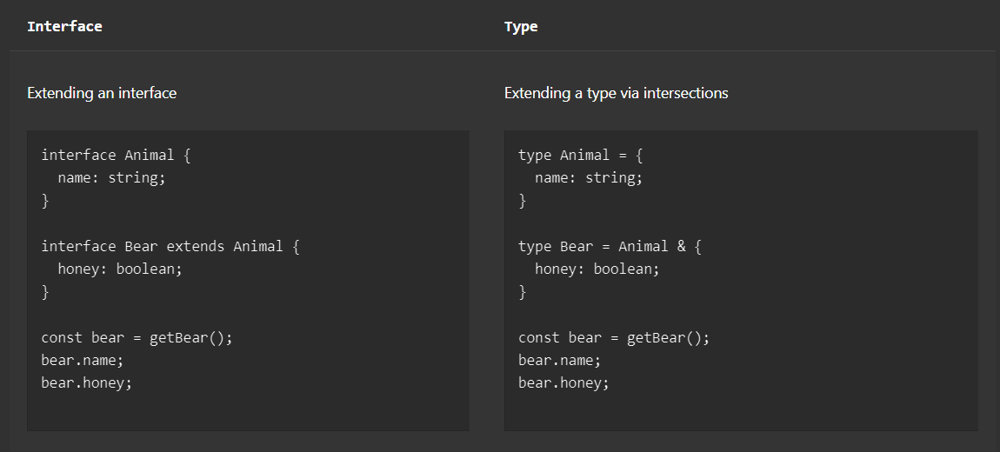

<h1 align=center>Typescript</h1>

# 1. Defining type 
- using `interface` declaration then declare a js object
    ```typescript
        // interface
        interface User {
        name: string;
        id: number;
        }

        //Object declaration
        const user: User = {
        name: "Hayes",
        id: 0,
        };
        //Báo lỗi khi khai báo không khớp với interface
        const user: User = {
            username: "Hayes",
            //Warning: Type '{ username: string; id: number; }' is not assignable to type 'User'.Object literal may only specify known properties, and 'username' does not exist in type 'User'.
            id: 0,
        };
    ```
- có thể sử dụng interface cho định nghĩa kiểu dữ liệu của param và có định nghĩa kiểu dữ liệu trả về của hàm
    ```typescript
        function deleteUser(user: User) {
        // ...
        }
        
        function getAdminUser(): User {
        //...
        }
    ```
- ngoài các kiểu dữ liệu nguyên  thủy : `boolean`, `bigint`, `null`, `number`, `string`, `symbol`, và `undefined`, typescript có thêm 
  - `any` : kiểu gì cũng được
  -  `unknown` :    
  -  `never`
  -  `void` : 1 hàm có thể return `underfined` hoặc không return gì cả
-  Composing type: Có thể kết hợp nhiều kiểu dữ liệu đơn giản để tạo nên 1 kiểu dữ liệu phức tạp. có 2 cách để thực hiện : sử dụng phép nối (|) hoặc generics
   -  Nối (|): 
        ```typescript
            type MyBool = true | false;
            // type MyBool = boolean
        ```
   -  Generics:
      ```typescript
        const [count,setCount] =   useState<number>()
      ```
- Interface
    ```typescript
        interface Point {
            x: number;
            y: number;
        }
        function printCoord(pt: Point) {
            console.log("The coordinate's x value is " + pt.x);
            console.log("The coordinate's y value is " + pt.y);
        }
            
        printCoord({ x: 100, y: 100 });
    ```
  - Khác biệt so với type: a type cannot be re-opened to add new properties vs an interface which is always extendable.
    
    
- Enums: describing a value which could be one of a set of possible named constants.
- `in` : "value" in x với value là 1 literal string và x là union type. Nhánh đúng sẽ thu hẹp kiểu của x (dù có thuộc tính value là optional hay required. Nhánh sai sẽ sẽ thy hẹp kiểu của x về 1 kiểu nào đó mà thuộc tính value là optional hoặc không có thuộc tính value)
  ```typescript
    type Fish = { swim: () => void };
    type Bird = { fly: () => void };
    
    function move(animal: Fish | Bird) {
    if ("swim" in animal) { // animal type here is Fish | Bird
        return animal.swim();// animal type here is narrow to Fish
    }
    
    return animal.fly();// type Bird
    }
  ```
- `instanceof`: `x instanceof Foo` kiểm tra chuỗi prototype của x có chưa chuỗi prototype của Foo hay không    

- Type predicate